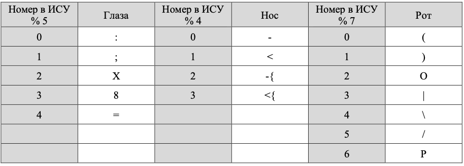

# InfaLab3
### [Задание 1](Report/prog1/)
1. Реализуйте программный продукт на языке Python, используя регулярные выражения по варианту.
2. Для своей программы придумайте минимум 5 тестов. Каждый тест является отдельной сущностью, передаваемой регулярному выражению для обработки. Для каждого теста необходимо самостоятельно (без использования регулярных выражений) найти правильный ответ. После чего сравнить ответ, выданный программой, и полученный самостоятельно.
3. Программа должна считать количество смайликов определённого вида (вид смайлика описан в таблице вариантов) в предложенном тексте. Все смайлики имеют такую структуру: [глаза][нос][рот].
### [Доп. задание №1](Report/prog2/)

